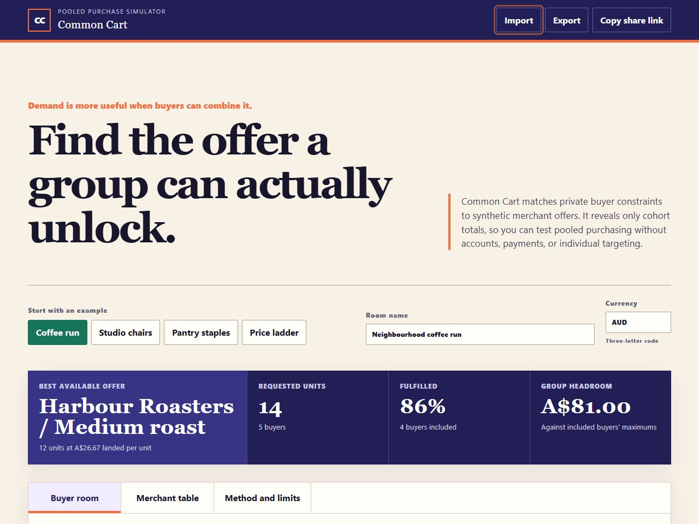

# The Smallest Agreement

The Smallest Agreement is a local, static workshop for a group that wants to test structured clause changes against a chosen approval threshold. It finds the lowest-cost combination that also respects optional group support floors, a change-cost budget, and locked clause choices.

It is deliberately a decision aid, not a decision maker. People define the groups, weights, support scores, clauses, alternatives, and change costs. The app does not interpret policy text or infer what an option means.



*Built-in synthetic neighborhood-plan scenario.*

## Use without installation

Open [standalone.html](standalone.html) directly in a current desktop or mobile browser. It is one self-contained file: no package installation, server, account, or network connection is needed. The full GUI, local autosave, JSON import, and JSON export work from `file://`.

Share link does not create a URL in this mode. A `file://` address points to a local path and is not a portable way to share a draft; export JSON instead. The button remains visible and explains that limit if it is used.

To regenerate or verify the standalone file from source:

```sh
npm run build:standalone
npm run build:standalone -- --check
```

## Run from source

Requires Node.js 20 or newer. No package installation is needed.

### Windows one-click

Double-click `launch-windows.cmd`. It checks for Node.js 20 or newer, starts the loopback-only server, and opens the GUI only after it is ready. Keep the command window open while using the app; press Ctrl+C there to stop it cleanly.

### Cross-platform terminal

From this project directory, run:

```sh
npm run launch
```

The launcher prints the local URL before it opens it. If the system browser opener is unavailable, open that printed URL manually. Press Ctrl+C in the terminal to stop the local server cleanly.

### Start server only

```sh
npm start
```

Open the local address shown in the terminal. The app listens only on `127.0.0.1`.

The project is also a static ESM app, so any static file server can host it.

### Checks

```sh
npm test
npm run check
```

## Use the workshop

1. Choose a synthetic preset or make a new proposal from the controls.
2. Set the approval threshold and participant group weights.
3. Give every option a support score from 0 to 100 for each group. Set each alternative's explicit change cost. Original options always have cost 0.
4. Optionally set a minimum average support for any group, a maximum total change cost, and an option lock on a clause. Blank budget and floor inputs mean no limit. Zero is an active limit. Unlock an option before removing it.
5. Review the current approval, recommendation, constraint checks, group shifts, coalition table, and near misses. If no combination satisfies every requirement, the app reports infeasibility and shows budget and floor rejection counts.
6. Export a Markdown brief for a meeting-ready handoff, or export JSON for a complete portable record. Both carry the constraints. When running through the local server, Share link can place the draft in the URL hash.

Each clause keeps one original option and at least two alternatives, so the workshop always compares a structured choice set.

The synthetic presets are Neighbourhood Plan, Open Source Policy, Association Budget, and Protected Access. Protected Access demonstrates why majority-weighted approval alone can miss a group's minimum support. It starts with a budget of 3, a 60% floor for new participants, and a locked safety-training clause. The recommendation costs 3 and gives that group 70% average support. Lower the budget to 2 to see an infeasible result.

## Local data and sharing

Drafts autosave to this browser's local storage. Invalid storage is ignored safely. Import accepts JSON files of 250 KB or smaller that pass the model's structural validation and discards fields the application does not understand. Export JSON creates a complete draft file. Export brief creates a deterministic Markdown report with the current result, recommendation, group-level changes, and near misses. It is a handoff of model output, not a decision record or a claim of legitimacy.

When the app is served locally, Share link serializes the complete proposal in the URL fragment. Fragments are not sent as part of an HTTP request, but anyone with the link can read the proposal. Do not use it for sensitive material. Share links longer than 60,000 characters are rejected; export JSON for larger drafts. The standalone `file://` mode does not create share links because local file addresses are not portable.

## Search boundary

The app exhaustively checks up to 50,000 lock-permitted combinations. Locks reduce the choice set; budgets and support floors do not bypass this limit. It does not sample, guess, or use hidden randomness. If the number of combinations is higher, it returns an explicit `too_large` result and does not recommend an agreement. Reduce alternatives or clauses, or lock choices, before relying on the result. If the original proposal already meets every requirement, one baseline check proves that no change is needed.

Near misses meet every configured constraint but miss the overall approval threshold. An over-budget or below-floor result is never offered as a near miss. Rejection counts can overlap when a combination fails both the budget and a floor.

See [MODEL.md](MODEL.md) for the formula, deterministic ordering, assumptions, and limits.

## What this cannot establish

A score can be incomplete, a weight can be contested, and a low numerical change cost can mask a large semantic shift. A passing result cannot confer legitimacy, consent, representation, fairness, legal validity, or authority to adopt the proposal. Keep deliberation, governing rules, and accountable human judgment outside the calculation.

Support floors protect only the numerical average you enter. They do not establish consent or prevent a low score on an individual clause. Clause locks express a supplied constraint, not a grant of decision authority.

## v1.2.0, 27-08-2026

- Added constrained agreement search with support floors, a total-cost budget, and option locks.
- Added a Protected Access preset, constraint explanations, and budget/floor rejection counts.
- Preserved constraints in JSON, browser autosave, share links, and Markdown briefs. Existing unconstrained drafts remain valid without migration.
- Corrected search reporting to distinguish the permitted search space from checks actually performed when the original already passes.
- Added independent exhaustive-oracle coverage across 128 synthetic cases, invalid-input checks, constraint boundary tests, and standalone control checks.

## Project files

- `index.html` and `styles.css`: accessible responsive interface.
- `src/model.js`: pure validation, calculation, deterministic search, and Markdown brief functions.
- `src/app.js`: local browser state, editing controls, import/export, brief download, URL sharing, and canvas display.
- `tests/model.test.mjs`: Node built-in test coverage for the model.
- `tests/standalone.test.mjs`: self-contained artifact checks.
- `.github/workflows/ci.yml`: Node 20+ syntax, standalone, and test checks on Ubuntu and Windows.
- `scripts/dev-server.mjs`: dependency-free localhost server.
- `scripts/launch.mjs`: cross-platform GUI launcher.
- `scripts/build-standalone.mjs`: deterministic standalone-file builder and stale-output check.
- `launch-windows.cmd`: Windows one-click launcher.
- `standalone.html`: no-install, self-contained GUI artifact.

## License

MIT. See [LICENSE](LICENSE).
