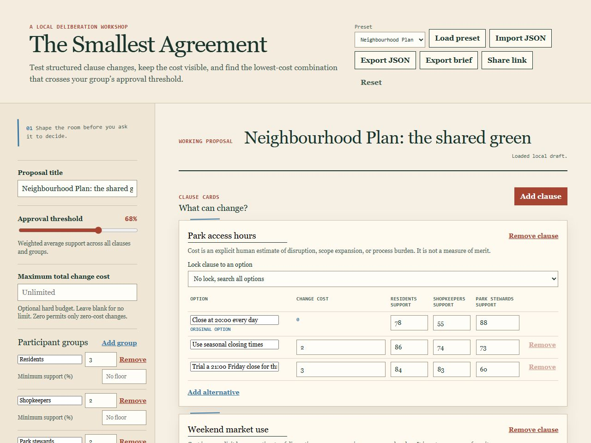

# The Smallest Agreement

The Smallest Agreement is a local, static workshop for a group that wants to test structured clause changes against a chosen approval threshold. It finds the lowest-cost combination that also respects optional group support floors, optional veto groups, a change-cost budget, and locked clause choices.

It is deliberately a decision aid, not a decision maker. People define the groups, weights, support scores, clauses, alternatives, and change costs. The app does not interpret policy text or infer what an option means.



*Built-in synthetic neighborhood-plan scenario.*

## Use without installation

Open [standalone.html](standalone.html) directly in a current desktop or mobile browser. It is one self-contained file: no package installation, server, account, or network connection is needed. The full GUI, local autosave, JSON import, and JSON export work from `file://`.

Share link does not create a URL in this mode. A `file://` address points to a local path and is not a portable way to share a draft; export JSON instead. The button remains visible and explains that limit if it is used.

To regenerate or verify the standalone file from source:

```sh
npm run build:standalone
npm run build:standalone -- --check
```

## Run from source

Requires Node.js 20 or newer. No package installation is needed.

### Windows one-click

Double-click `launch-windows.cmd`. It checks for Node.js 20 or newer, starts the loopback-only server, and opens the GUI only after it is ready. Keep the command window open while using the app; press Ctrl+C there to stop it cleanly.

### Cross-platform terminal

From this project directory, run:

```sh
npm run launch
```

The launcher prints the local URL before it opens it. If the system browser opener is unavailable, open that printed URL manually. Press Ctrl+C in the terminal to stop the local server cleanly.

`npm run launch -- --help` lists flags. `--no-open` prints the URL without opening a browser. `PORT` must be an integer from 1 through 65535; omit it to use 4173. Empty PORT values and unknown arguments are rejected with that usage text. `HOST` is not read; the server always binds `127.0.0.1`.

### Start server only

```sh
npm start
```

Open the local address shown in the terminal. The app listens only on `127.0.0.1`. `HOST` is not read. `PORT` uses the same rules as the launcher: an integer from 1 through 65535, default 4173. Empty and invalid values are rejected before the server listens.

The project is also a static ESM app, so any static file server can host it.

### Checks

```sh
npm test
npm run check
```

## Use the workshop

1. Choose a synthetic preset or make a new proposal from the controls.
2. Set the approval threshold and participant group weights.
3. Give every option a support score from 0 to 100 for each group. Set each alternative's explicit change cost. Original options always have cost 0.
4. Optionally set a minimum average support for any group, mark a veto group, a maximum total change cost, and an option lock on a clause. Blank budget and floor inputs mean no limit. Zero is an active limit. Unlock an option before removing it. A veto is a numerical constraint, not a legal right.
5. Save a named snapshot before changing assumptions. The local library holds up to 20 independent snapshots. Loading, importing, resetting, and editing can be undone through up to 50 in-tab changes; a new edit clears redo.
6. Review up to five ranked passing packages, their lowest group support, and groups losing support. If no package satisfies every requirement, inspect constraint checks and near misses. Clause contribution and group contribution explain the arithmetic; they are not bargaining power.
7. Try a custom package and pin it beside the original and the solver recommendation. Preview locking an option, or lock a whole recommended or near-miss package in one undoable step. Reduce support by a chosen number of points to test the recommendation under a deterministic downside scenario. Leave-one-group-out omits a group's weight from the average as a sensitivity check, not a forecast.
8. Compare the working draft with a saved snapshot. Review changed inputs before comparing output metrics, especially when groups, weights, or clauses differ.
    9. Export JSON to reopen the draft, CSV for all modeled input evidence, a support-matrix CSV of scores only, a groups CSV of participant rows, a worksheet CSV of groups and options as text, or a Markdown brief with ranked packages. Copy recommended package puts the solver's selected options on the clipboard, with a textarea fallback if the clipboard is blocked; it is not a recorded vote. Copy option count writes the recommended package option count as one line (count only); it is not a recorded vote. Copy original versus recommended lists option labels and costs only; it is not a recorded vote. Copy remaining budget writes leftover change-budget as one line; it is not a legal appropriation. Copy approval threshold writes the threshold as one line; it is a number you entered, not a legal quorum. Copy group support writes a Markdown table of group name, mixing weight, and average support; mixing weights are not a legal right. Copy package table lists original, recommended, and pinned labels. Copy current locks lists each clause title with the locked option, or Unlocked; it is not a legal hold. Copy lock count writes the current clause lock count as one line; locks are draft choices, not a legal hold. Copy first locked option writes the first locked clause option label as one line, or an honest empty line when none; it is distinct from lock-count copy and current-locks copy. Copy below-floor group count writes the count of groups currently below their declared support floor as one line, or an honest zero; a floor is a number you entered, not a legal quorum. Copy first below-floor group writes the first below-floor group label as one line, or an honest empty line when none; it is distinct from below-floor count copy, lock-count copy, and first-locked-option copy. Do not treat the label as a legal identity. Copy threshold-group count writes the count of groups currently meeting the numeric approval threshold as one line, or an honest zero; a threshold is a number you entered, not a legal quorum. Copy first veto group writes the first veto group label as one line, or an honest empty line when none; it is distinct from first-below-floor group copy and threshold-group count copy. A veto is a number you entered, not a legal right. Do not treat the label as a legal identity. Copy veto-group count writes the count of groups marked as a veto group as one line, or an honest zero; it is distinct from threshold-group count copy and first veto group copy. A veto is a number you entered, not a legal right. Copy first non-veto group writes the first non-veto group label as one line, or an honest empty line when none; it is distinct from first veto group copy, veto-group count copy, and last veto group copy. A veto is a number you entered, not a legal right. Do not treat the label as a legal identity. Copy last veto group writes the last veto group label as one line, or an honest empty line when none; it is distinct from first veto group copy and first non-veto group copy. A veto is a number you entered, not a legal right. Copy last non-veto group writes the last non-veto group label as one line, or an honest empty line when none; it is distinct from last veto group copy and first non-veto group copy. A veto is a number you entered, not a legal right. Do not treat the label as a legal identity. Copy last below-threshold group writes the last group below the numeric approval threshold as one line, or an honest empty line when none; a threshold is a number you entered, not a legal quorum. Do not treat the label as a legal identity. Copy first below-threshold group writes the first group below the numeric approval threshold as one line, or an honest empty line when none; it is distinct from last below-threshold group copy. A threshold is a number you entered, not a legal quorum. Do not treat the label as a legal identity. Copy last at-or-above-threshold group writes the last group at or above the numeric approval threshold as one line, or an honest empty line when none; it is distinct from last below-threshold group copy, first below-threshold group copy, and threshold-group count copy. A threshold is a number you entered, not a legal quorum. Do not treat the label as a legal identity. Copy first at-or-above-threshold group writes the first group at or above the numeric approval threshold as one line, or an honest empty line when none; it is distinct from last at-or-above-threshold group copy and first below-threshold group copy. A threshold is a number you entered, not a legal quorum. Do not treat the label as a legal identity. Copy last at-floor group writes the last group currently meeting their declared support floor as one line, or an honest empty line when none; it is distinct from last at-or-above-threshold group copy, first at-or-above-threshold group copy, first at-floor group copy, and hideLastGroupAtFloor. A floor is a number you entered, not a legal quorum. Do not treat the label as a legal identity. Copy first at-floor group writes the first group currently meeting their declared support floor as one line, or an honest empty line when none; it is distinct from last at-floor group copy, first at-or-above-threshold group copy, and hideFirstGroupAtFloor. A floor is a number you entered, not a legal quorum. Do not treat the label as a legal identity. Copy last below-floor group writes the last group currently below their declared support floor as one line, or an honest empty line when none; it is distinct from first-below-floor group copy, last below-threshold group copy, last at-floor group copy, hideFirstGroupBelowFloor, and hideLastGroupBelowFloor. A floor is a number you entered, not a legal quorum. Do not treat the label as a legal identity. Copy last group without a support floor writes the last group whose minSupport is missing as one line, or an honest empty line when none; it is distinct from first at-floor group copy, last at-floor group copy, first-below-floor group copy, last-below-floor group copy, hideGroupsWithoutFloors, and hideLastGroupWithoutFloor. A floor is a number you entered, not a legal quorum. Do not treat the label as a legal identity. Copy first group without a support floor writes the first group whose minSupport is missing as one line, or an honest empty line when none; it is distinct from last group-without-floor copy, first at-floor group copy, last at-floor group copy, first-below-floor group copy, last-below-floor group copy, groups-without-floor count copy, hideGroupsWithoutFloors, hideLastGroupWithoutFloor, and hideFirstGroupWithoutFloor. A floor is a number you entered, not a legal quorum. Do not treat the label as a legal identity. Copy groups-without-floor count writes the count of groups whose minSupport is missing as one line, or an honest zero; it is distinct from first group-without-floor label copy and last group-without-floor label copy. A floor is a number you entered, not a legal quorum. Copy groups-without-floor remaining writes remaining mixing-weight total of groups whose minSupport is missing as one line, or an honest zero; it is distinct from last-without-floor remaining copy, first-without-floor remaining copy, groups-without-floor count copy, first group-without-floor label copy, last group-without-floor label copy, and remaining change-budget copy. A floor is a number you entered, not a legal quorum. Mixing weights are not a legal right. Copy last-without-floor remaining writes remaining mixing weight of the last group whose minSupport is missing as one line, or an honest zero; it is distinct from first-without-floor remaining copy, aggregate groups-without-floor remaining copy, groups-without-floor count copy, first group-without-floor label copy, last group-without-floor label copy, and remaining change-budget copy. A floor is a number you entered, not a legal quorum. Mixing weights are not a legal right. Copy first-without-floor remaining writes remaining mixing weight of the first group whose minSupport is missing as one line, or an honest zero; it is distinct from first-without-floor cost copy, last-without-floor remaining copy, aggregate groups-without-floor remaining copy, groups-without-floor count copy, first group-without-floor label copy, last group-without-floor label copy, and remaining change-budget copy. A floor is a number you entered, not a legal quorum. Mixing weights are not a legal right. Copy first-without-floor cost writes mixing-weight cost of the first group whose minSupport is missing as one line, or an honest zero; it is distinct from first-without-floor remaining copy, last-without-floor remaining copy, aggregate groups-without-floor remaining copy, groups-without-floor count copy, first group-without-floor label copy, last group-without-floor label copy, and remaining change-budget copy. A floor is a number you entered, not a legal quorum. Mixing weights are not a legal right. Copy change-cost table writes a compact CSV of original versus recommended option labels and cost delta. Print facilitator pack hides the workshop tour and keeps original vs solver vs pin, notes, veto highlights, recommended package option labels, a one-line remaining change-budget, the numeric approval threshold, a one-line lock count, the first locked clause option label as one line, a one-line below-floor group count, the first below-floor group label as one line, a one-line threshold-group count, the first veto group label as one line, a one-line veto-group count, the first non-veto group label as one line, and the last veto group label as one line. Print redacted uses Group 1 through Group N in place of group display names, including the last veto group line; the saved draft is unchanged. Paste a clause-options TSV or CSV into the clause table, or paste a groups TSV or CSV into the groups editor, using the same validation as file import. Partial group pastes are rejected. When served, Share link places the draft in the URL hash.

Each clause keeps one original option and at least two alternatives, so the workshop always compares a structured choice set.

The synthetic presets are Neighbourhood Plan, Open Source Policy, Association Budget, Protected Access, Workplace Hybrid, Club Constitution, Library Quiet Hours, Sports Fixture Night, Market stall hours, Shared bike shed, Street stall lighting, Hall hire hours, Community garden watering, Shared laundry hours, Rooftop BBQ hours, School disco hours, Sports day hours, Netball training hours, Swimming club hours, Athletics club hours, Cricket club hours, Tennis club hours, Basketball club hours, Volleyball club hours, Soccer club hours, Hockey club hours, Rugby club hours, Softball club hours, Lacrosse club hours, Water polo club hours, Rowing club hours, Sailing club hours, Canoeing club hours, Kayaking club hours, Dragon boat club hours, Surf club hours, and Triathlon club hours. Protected Access demonstrates why majority-weighted approval alone can miss a group's minimum support. It starts with a budget of 3, a 60% floor for new participants, and a locked safety-training clause. The recommendation costs 3 and gives that group 70% average support. Lower the budget to 2 to see an infeasible result. Workplace Hybrid is a three-group office presence policy with on-site staff, remote staff, and managers. Club Constitution is a synthetic membership-meeting workshop with members, officers (a veto group), and club staff, covering quorum, proxy votes, and guest speakers. Library Quiet Hours is a synthetic reading-room workshop with readers, families, and library staff (a veto group), covering evening hours, children's-area sound rules, and after-hours events. Sports Fixture Night is a synthetic match-evening workshop with members, neighbours (a veto group), and council rangers, covering match end-time, floodlights, and parking. Market stall hours is a synthetic stall workshop with stallholders, neighbours (a veto group), and market officers, covering stall open hours, packing, and neighbour noise. Shared bike shed is a synthetic neighbour workshop with bike users, neighbours (a veto group), and building managers, covering access hours, lighting, and lock-up. Street stall lighting is a synthetic stall workshop with stallholders, nearby residents (a veto group), and council officers, covering lighting hours, glare, and pack-down. Hall hire hours is a synthetic hall workshop with hirers, neighbours (a veto group), and hall committee, covering close time, PA volume, and clean-up. Community garden watering is a synthetic plot workshop with plot-holders, neighbours (a veto group), and garden committee, covering watering hours, hose noise, and lock-up. Shared laundry hours is a synthetic laundry workshop with tenants, neighbours (a veto group), and building managers, covering wash hours, dryer noise, and lock-up. Rooftop BBQ hours is a synthetic rooftop workshop with residents, neighbours (a veto group), and building committee, covering cook hours, smoke, and lock-up. School disco hours is a synthetic school-hall workshop with students, neighbours (a veto group), and P&C, covering finish time, bass, and lock-up. Sports day hours is a synthetic sports-field workshop with students, neighbours (a veto group), and P&C, covering race start, PA volume, and lock-up. Netball training hours is a synthetic netball-court workshop with students, neighbours (a veto group), and P&C, covering start time, court lights, and lock-up. Swimming club hours is a synthetic pool workshop with students, neighbours (a veto group), and P&C, covering pool open, lane lights, and lock-up. Athletics club hours is a synthetic track workshop with students, neighbours (a veto group), and P&C, covering track open, PA volume, and lock-up. Cricket club hours is a synthetic cricket workshop with students, neighbours (a veto group), and P&C, covering scoring nets, tea room, and lock-up. Tennis club hours is a synthetic tennis workshop with students, neighbours (a veto group), and P&C, covering court booking, ball machines, and lock-up. Basketball club hours is a synthetic indoor-court workshop with students, neighbours (a veto group), and P&C, covering hall booking, ball racks, and lock-up. Volleyball club hours is a synthetic hall/court workshop with students, neighbours (a veto group), and P&C, covering hall/court booking, net posts, and lock-up. Soccer club hours is a synthetic outdoor-pitch workshop with students, neighbours (a veto group), and P&C, covering pitch booking, goal nets, and changing-room lock-up. Hockey club hours is a synthetic ice-rink workshop with students, neighbours (a veto group), and P&C, covering ice booking, rink boards, and changing-room lock-up. Rugby club hours is a synthetic outdoor-pitch and clubhouse workshop with students, neighbours (a veto group), and P&C, covering outdoor pitch booking, clubhouse bar, and changing-room lock-up. Softball club hours is a synthetic softball-diamond and clubhouse workshop with students, neighbours (a veto group), and P&C, covering softball diamond booking, clubhouse bar, and changing-room lock-up. Distinct from rugby-club-hours (pitch) and hockey-club-hours (ice). Lacrosse club hours is a synthetic lacrosse-field and clubhouse workshop with students, neighbours (a veto group), and P&C, covering lacrosse field booking, clubhouse bar, and changing-room lock-up. Distinct from softball-club-hours (diamond) and rugby-club-hours (pitch). Water polo club hours is a synthetic water polo pool and clubhouse workshop with students, neighbours (a veto group), and P&C, covering water polo pool booking, clubhouse bar, and changing-room lock-up. Distinct from lacrosse-club-hours (field), softball-club-hours (diamond), rugby-club-hours (pitch), and swimming-club-hours (pool open). Rowing club hours is a synthetic rowing pontoon, boat-house, and clubhouse workshop with students, neighbours (a veto group), and P&C, covering rowing pontoon and boat-house booking, clubhouse bar, and changing-room lock-up. Distinct from water-polo-club-hours (pool), lacrosse-club-hours (field), softball-club-hours (diamond), rugby-club-hours (pitch), and swimming-club-hours (pool open). Sailing club hours is a synthetic sailing jetty, yacht-club, and clubhouse workshop with students, neighbours (a veto group), and P&C, covering sailing jetty and yacht-club booking, clubhouse bar, and changing-room lock-up. Distinct from rowing-club-hours (pontoon), water-polo-club-hours (pool), lacrosse-club-hours (field), softball-club-hours (diamond), rugby-club-hours (pitch), and swimming-club-hours (pool open). Canoeing club hours is a synthetic canoe shed, paddle pontoon, and clubhouse workshop with students, neighbours (a veto group), and P&C, covering canoe shed and paddle-pontoon booking, clubhouse bar, and changing-room lock-up. Distinct from sailing-club-hours (jetty/yacht), rowing-club-hours (pontoon), water-polo-club-hours (pool), lacrosse-club-hours (field), softball-club-hours (diamond), rugby-club-hours (pitch), and swimming-club-hours (pool open). Kayaking club hours is a synthetic whitewater, slalom-bar, and spraydeck workshop with students, neighbours (a veto group), and P&C, covering whitewater booking, slalom bar hours, and spraydeck lock-up. Distinct from canoeing-club-hours (canoe-shed/paddle-pontoon), sailing-club-hours (jetty/yacht), rowing-club-hours (pontoon), water-polo-club-hours (pool), lacrosse-club-hours (field), softball-club-hours (diamond), rugby-club-hours (pitch), and swimming-club-hours (pool open). Dragon boat club hours is a synthetic dragon-boat staging, drum-bar, and paddle-box workshop with students, neighbours (a veto group), and P&C, covering dragon-boat staging booking, drum bar hours, and paddle-box lock-up. Distinct from kayaking-club-hours (whitewater/slalom/spraydeck), canoeing-club-hours (canoe-shed/paddle-pontoon), sailing-club-hours (jetty/yacht), rowing-club-hours (pontoon), water-polo-club-hours (pool), lacrosse-club-hours (field), softball-club-hours (diamond), rugby-club-hours (pitch), and swimming-club-hours (pool open). Surf club hours is a synthetic surf-club staging, clubhouse-bar, and board-bag workshop with students, neighbours (a veto group), and P&C, covering surf-club staging booking, clubhouse bar hours, and board-bag lock-up. Distinct from dragon-boat-club-hours (staging/drum bar/paddle-box), kayaking-club-hours (whitewater/slalom/spraydeck), canoeing-club-hours (canoe-shed/paddle-pontoon), sailing-club-hours (jetty/yacht), and swimming-club-hours (pool open). Triathlon club hours is a synthetic triathlon staging, transition-area, and bike-bag workshop with students, neighbours (a veto group), and P&C, covering triathlon staging booking, transition-area hours, and bike-bag lock-up. Distinct from surf-club-hours (staging/clubhouse bar/board-bag), dragon-boat-club-hours (staging/drum bar/paddle-box), kayaking-club-hours (whitewater/slalom/spraydeck), canoeing-club-hours (canoe-shed/paddle-pontoon), sailing-club-hours (jetty/yacht), and swimming-club-hours (pool open). Neighbours veto is a flag you entered, not a legal right. It is not a recorded vote.

## Local data and sharing

Drafts autosave to this browser's local storage. Invalid storage is ignored safely. Import accepts JSON files of 250 KB or smaller that pass the model's structural validation. Unknown fields on the proposal, groups, clauses, and options are discarded; extra support keys, duplicate identifiers, reserved prototype keys, and non-finite weights or costs are rejected. Export JSON creates a complete draft file. Export brief creates a deterministic Markdown report with the current result, recommendation, group-level changes, and near misses. It is a handoff of model output, not a decision record or a claim of legitimacy.

When the app is served locally, Share link serializes the complete proposal in the URL fragment. Fragments are not sent as part of an HTTP request, but anyone with the link can read the proposal. Do not use it for sensitive material. Share links longer than 60,000 characters are rejected; export JSON for larger drafts. The standalone `file://` mode does not create share links because local file addresses are not portable.

## Search boundary

For offline file and pipeline analysis, see the [analyst commands](ANALYST.md).

The app exhaustively checks up to 50,000 lock-permitted combinations. Locks reduce the choice set; budgets, support floors, and vetoes do not bypass this limit. It does not sample, guess, or use hidden randomness. If the number of combinations is higher, it returns an explicit `too_large` result and does not recommend an agreement. Reduce alternatives or clauses, or lock choices, before relying on the result. The GUI enumerates the bounded space to show passing alternatives even when the original already passes. Direct model callers retain the one-check baseline shortcut unless they request alternatives.

Near misses meet every configured constraint but miss the overall approval threshold. An over-budget, below-floor, or below-veto result is never offered as a near miss. Rejection counts can overlap when a combination fails more than one constraint.

See [MODEL.md](MODEL.md) for the formula, deterministic ordering, assumptions, and limits.

## What this cannot establish

A score can be incomplete, a weight can be contested, and a low numerical change cost can mask a large semantic shift. A passing result cannot confer legitimacy, consent, representation, fairness, legal validity, or authority to adopt the proposal. Keep deliberation, governing rules, and accountable human judgment outside the calculation.

Support floors and veto marks protect only the numerical averages you enter. They do not establish consent, a legal veto, or prevent a low score on an individual clause. Clause locks express a supplied constraint, not a grant of decision authority. Optional clause notes are facilitator reminders only.

## v1.5.30, 11-09-2026

Triathlon club hours, first-without-floor-cost copy, and first-without-floor hide jump in The Smallest Agreement 1.5.30.

- Added keyboard `Shift+F7`, `Shift+F8`, and `Shift+F9` for first-without-floor cost copy, the first-without-floor cost copy control, and the existing hide-first-group-without-floor control. Remaining copy stays on its button. The `shiftKey && F7` branch is handled before unshifted `F7`. Shortcut help lists them. Shortcuts are ignored while typing. Unshifted `F7`, `F8`, and `F9` stay last-without-floor label copy, last-without-floor copy jump, and hide-last-group-without-floor jump. `Shift+F10` count stays. `Shift+F12` and `F12` still jump to hide-first-group-without-floor. That first-without-floor hide stays on screen. A floor is a number you entered, not a legal quorum.
- Added copy of mixing-weight cost of the first group without a declared support floor as one-line Markdown, with a clipboard fallback. Honest 0 when none. Distinct prefix from first-without-floor remaining copy, last-without-floor remaining copy, aggregate groups-without-floor remaining copy, groups-without-floor count copy, first group-without-floor label copy, last group-without-floor label copy, and remaining change-budget copy. A floor is a number you entered, not a legal quorum. Mixing weights are not a legal right. Display-only. Workspace JSON is unchanged.
- Added the Triathlon club hours preset: students, neighbours, and P&C scoring triathlon staging booking, transition-area hours, and bike-bag lock-up. Distinct from Surf club hours (staging/clubhouse bar/board-bag), Dragon boat club hours (staging/drum bar/paddle-box), Kayaking club hours (whitewater/slalom/spraydeck), Canoeing club hours (canoe-shed/paddle-pontoon), Sailing club hours (jetty/yacht), and Swimming club hours (pool open). Neighbours veto is a flag you entered, not a legal right. A veto is a number, not a legal right. Not a recorded vote.
- Kept the 1.5.0 package review tools, `createAgreementReviewPacket`, replay, and AGREEMENT_REVIEW_TOOLS.

See [CHANGELOG.md](CHANGELOG.md) for the full list.

## v1.5.29, 11-09-2026

Surf club hours, first-without-floor-remaining copy, and last-without-floor hide jump in The Smallest Agreement 1.5.29.

- Added keyboard `Shift+F7`, `Shift+F8`, and `Shift+F9` for first-without-floor remaining copy, the first-without-floor remaining copy control, and the existing hide-last-group-without-floor control. The `shiftKey && F7` branch is handled before unshifted `F7`. Shortcut help lists them. Shortcuts are ignored while typing. Unshifted `F7`, `F8`, and `F9` stay last-without-floor label copy, last-without-floor copy jump, and hide-last-group-without-floor jump. `Shift+F10` count stays. `Shift+F12` and `F12` still jump to hide-first-group-without-floor. That first-without-floor hide stays on screen. A floor is a number you entered, not a legal quorum.
- Added copy of remaining mixing weight of the first group without a declared support floor as one-line Markdown, with a clipboard fallback. Honest 0 when none. Distinct prefix from last-without-floor remaining copy, aggregate groups-without-floor remaining copy, groups-without-floor count copy, first group-without-floor label copy, last group-without-floor label copy, and remaining change-budget copy. A floor is a number you entered, not a legal quorum. Mixing weights are not a legal right. Display-only. Workspace JSON is unchanged.
- Added the Surf club hours preset: students, neighbours, and P&C scoring surf-club staging booking, clubhouse bar hours, and board-bag lock-up. Distinct from Dragon boat club hours (staging/drum bar/paddle-box), Kayaking club hours (whitewater/slalom/spraydeck), Canoeing club hours (canoe-shed/paddle-pontoon), Sailing club hours (jetty/yacht), and Swimming club hours (pool open). Neighbours veto is a flag you entered, not a legal right. Not a recorded vote.
- Kept the 1.5.0 package review tools, `createAgreementReviewPacket`, replay, and AGREEMENT_REVIEW_TOOLS.

See [CHANGELOG.md](CHANGELOG.md) for the full list.

## v1.5.28, 11-09-2026

Dragon boat club hours, last-without-floor-remaining copy, and first-without-floor hide jump in The Smallest Agreement 1.5.28.

- Added keyboard `Shift+F7`, `Shift+F8`, and `Shift+F9` for last-without-floor remaining copy, the last-without-floor remaining copy control, and the existing hide-first-group-without-floor control. The `shiftKey && F7` branch is handled before unshifted `F7`. Shortcut help lists them. Shortcuts are ignored while typing. Unshifted `F7`, `F8`, and `F9` stay last-without-floor label copy, last-without-floor copy jump, and hide-last-group-without-floor jump. `Shift+F10` count stays. `Shift+F12` and `F12` still jump to hide-first-group-without-floor. A floor is a number you entered, not a legal quorum.
- Added copy of remaining mixing weight of the last group without a declared support floor as one-line Markdown, with a clipboard fallback. Honest 0 when none. Distinct prefix from aggregate groups-without-floor remaining copy, groups-without-floor count copy, first group-without-floor label copy, last group-without-floor label copy, and remaining change-budget copy. A floor is a number you entered, not a legal quorum. Mixing weights are not a legal right. Display-only. Workspace JSON is unchanged.
- Added the Dragon boat club hours preset: students, neighbours, and P&C scoring dragon-boat staging booking, drum bar hours, and paddle-box lock-up. Distinct from Kayaking club hours (whitewater/slalom/spraydeck), Canoeing club hours (canoe-shed/paddle-pontoon), Sailing club hours (jetty/yacht), Rowing club hours (pontoon), Water polo club hours (pool), Lacrosse club hours (field), Softball club hours (diamond), Rugby club hours (pitch), and Swimming club hours (pool open). Neighbours veto is a flag you entered, not a legal right. Not a recorded vote.
- Kept the 1.5.0 package review tools, `createAgreementReviewPacket`, replay, and AGREEMENT_REVIEW_TOOLS.

See [CHANGELOG.md](CHANGELOG.md) for the full list.

## v1.5.27, 11-09-2026

Kayaking club hours, without-floor-remaining copy, and last-without-floor hide jump in The Smallest Agreement 1.5.27.

- Added keyboard `Shift+F7`, `Shift+F8`, and `Shift+F9` for groups-without-floor remaining copy, the groups-without-floor remaining copy control, and the existing hide-last-group-without-floor control. The `shiftKey && F7` branch is handled before unshifted `F7`. Shortcut help lists them. Shortcuts are ignored while typing. Unshifted `F7`, `F8`, and `F9` stay last-without-floor label copy, last-without-floor copy jump, and hide-last-group-without-floor jump. `Shift+F10` count stays. A floor is a number you entered, not a legal quorum.
- Added copy of remaining mixing-weight total of groups without a declared support floor as one-line Markdown, with a clipboard fallback. Honest 0 when none. Distinct prefix from groups-without-floor count copy, first group-without-floor label copy, last group-without-floor label copy, and remaining change-budget copy. A floor is a number you entered, not a legal quorum. Mixing weights are not a legal right. Display-only. Workspace JSON is unchanged.
- Added the Kayaking club hours preset: students, neighbours, and P&C scoring whitewater booking, slalom bar hours, and spraydeck lock-up. Distinct from Canoeing club hours (canoe-shed/paddle-pontoon), Sailing club hours (jetty/yacht), Rowing club hours (pontoon), Water polo club hours (pool), Lacrosse club hours (field), Softball club hours (diamond), Rugby club hours (pitch), and Swimming club hours (pool open). Neighbours veto is a flag you entered, not a legal right. Not a recorded vote.
- Kept the 1.5.0 package review tools, `createAgreementReviewPacket`, replay, and AGREEMENT_REVIEW_TOOLS.

See [CHANGELOG.md](CHANGELOG.md) for the full list.

## v1.5.26, 11-09-2026

Canoeing club hours, without-floor-count copy, and first-without-floor hide jump in The Smallest Agreement 1.5.26.

- Added keyboard `Shift+F10`, `Shift+F11`, and `Shift+F12` for groups-without-floor count copy, the groups-without-floor count copy control, and the existing hide-first-group-without-floor control. The `shiftKey && F10` branch is handled before unshifted `F10`. Shortcut help lists them. Shortcuts are ignored while typing. Unshifted `F10`, `F11`, and `F12` stay first-without-floor label copy, first-without-floor copy jump, and hide-first-group-without-floor jump. A floor is a number you entered, not a legal quorum.
- Added copy of the count of groups without a declared support floor as one-line Markdown, with a clipboard fallback. Honest 0 when none. Distinct prefix from first group-without-floor label copy and last group-without-floor label copy. A floor is a number you entered, not a legal quorum.
- Added the Canoeing club hours preset: students, neighbours, and P&C scoring canoe shed and paddle-pontoon booking, clubhouse bar, and changing-room lock-up. Distinct from Sailing club hours (jetty/yacht), Rowing club hours (pontoon), Water polo club hours (pool), Lacrosse club hours (field), Softball club hours (diamond), Rugby club hours (pitch), and Swimming club hours (pool open). Not a recorded vote.
- Kept the 1.5.0 package review tools, `createAgreementReviewPacket`, replay, and AGREEMENT_REVIEW_TOOLS.

See [CHANGELOG.md](CHANGELOG.md) for the full list.

## v1.5.25, 11-09-2026

Sailing club hours, first-without-floor copy, and first-without-floor hide in The Smallest Agreement 1.5.25.

- Added keyboard `F10`, `F11`, and `F12` for first group-without-floor copy, the first group-without-floor copy control, and the hide-first-group-without-floor control. Shortcut help lists them. Shortcuts are ignored while typing. The label is not a legal identity. A floor is a number you entered, not a legal quorum.
- Added copy of the first group without a declared support floor as one-line Markdown, with a clipboard fallback. Honest when none. Distinct from last group-without-floor copy, first at-floor group copy, last at-floor group copy, first-below-floor group copy, and last-below-floor group copy. A floor is a number you entered, not a legal quorum. Do not treat the label as a legal identity.
- Added a display filter that hides only the first group that has no declared support floor. Hidden groups still count in the model. Workspace JSON persists that optional boolean and rejects unknown keys. Older files omit the key and default to show-all. The solver ignores it. Distinct from hideGroupsWithoutFloors and hideLastGroupWithoutFloor. If composed with other hides, the empty-groups notice is honest and model counts stay the same. A floor is a number you entered, not a legal quorum.
- Added the Sailing club hours preset: students, neighbours, and P&C scoring sailing jetty and yacht-club booking, clubhouse bar, and changing-room lock-up. Distinct from Rowing club hours (pontoon), Water polo club hours (pool), Lacrosse club hours (field), Softball club hours (diamond), Rugby club hours (pitch), and Swimming club hours (pool open). Not a recorded vote.
- Kept the 1.5.0 package review tools, `createAgreementReviewPacket`, replay, and AGREEMENT_REVIEW_TOOLS.

See [CHANGELOG.md](CHANGELOG.md) for the full list.

## v1.5.24, 11-09-2026

Rowing club hours, last-without-floor copy, and last-without-floor hide in The Smallest Agreement 1.5.24.

- Added keyboard `F7`, `F8`, and `F9` for last group-without-floor copy, the last group-without-floor copy control, and the hide-last-group-without-floor control. Shortcut help lists them. Shortcuts are ignored while typing. The label is not a legal identity. A floor is a number you entered, not a legal quorum.
- Added copy of the last group without a declared support floor as one-line Markdown, with a clipboard fallback. Honest when none. Distinct from first at-floor group copy, last at-floor group copy, first-below-floor group copy, and last-below-floor group copy. A floor is a number you entered, not a legal quorum. Do not treat the label as a legal identity.
- Added a display filter that hides only the last group that has no declared support floor. Hidden groups still count in the model. Workspace JSON persists that optional boolean and rejects unknown keys. Older files omit the key and default to show-all. The solver ignores it. Distinct from hideGroupsWithoutFloors and hideLastGroupBelowFloor. If composed with other hides, the empty-groups notice is honest and model counts stay the same. A floor is a number you entered, not a legal quorum.
- Added the Rowing club hours preset: students, neighbours, and P&C scoring rowing pontoon and boat-house booking, clubhouse bar, and changing-room lock-up. Distinct from Water polo club hours (pool), Lacrosse club hours (field), Softball club hours (diamond), Rugby club hours (pitch), and Swimming club hours (pool open). Not a recorded vote.
- Kept the 1.5.0 package review tools, `createAgreementReviewPacket`, replay, and AGREEMENT_REVIEW_TOOLS.

See [CHANGELOG.md](CHANGELOG.md) for the full list.

## v1.5.23, 11-09-2026

Water polo club hours, first-at-floor copy, and last-below-floor hide in The Smallest Agreement 1.5.23.

- Added keyboard `F3`, `F4`, and `Backspace` for first at-floor group copy, the first at-floor group copy control, and the hide-last-group-below-floor control. Shortcut help lists them. Shortcuts are ignored while typing. The label is not a legal identity. A floor is a number you entered, not a legal quorum.
- Added copy of the first group currently meeting their declared support floor as one-line Markdown, with a clipboard fallback. Honest when none. Distinct from last at-floor group copy, first at-or-above-threshold group copy, and hideFirstGroupAtFloor. A floor is a number you entered, not a legal quorum. Do not treat the label as a legal identity.
- Added a display filter that hides only the last group whose average is currently below their declared support floor. Hidden groups still count in the model. Workspace JSON persists that optional boolean and rejects unknown keys. Older files omit the key and default to show-all. The solver ignores it. Distinct from hideFirstGroupBelowFloor, hideLastGroupBelowThreshold, hideLastGroupAtFloor, hideGroupsAtFloor, and belowFloorGroupsOnly. If composed with other hides, the empty-groups notice is honest and model counts stay the same. A floor is a number you entered, not a legal quorum.
- Added the Water polo club hours preset: students, neighbours, and P&C scoring water polo pool booking, clubhouse bar, and changing-room lock-up. Distinct from Lacrosse club hours (field), Softball club hours (diamond), Rugby club hours (pitch), and Swimming club hours (pool open). Not a recorded vote.
- Kept the 1.5.0 package review tools, `createAgreementReviewPacket`, replay, and AGREEMENT_REVIEW_TOOLS.

See [CHANGELOG.md](CHANGELOG.md) for the full list.

## v1.5.22, 11-09-2026

Lacrosse club hours, last-below-floor copy, and first-below-floor hide in The Smallest Agreement 1.5.22.

- Added keyboard `Delete`, `F2`, and `ArrowRight` for last below-floor group copy, the last below-floor group copy control, and the hide-first-group-below-floor control. Shortcut help lists them. Shortcuts are ignored while typing. The label is not a legal identity. A floor is a number you entered, not a legal quorum.
- Added copy of the last group currently below their declared support floor as one-line Markdown, with a clipboard fallback. Honest when none. Distinct from first-below-floor group copy, last below-threshold group copy, and last at-floor group copy. A floor is a number you entered, not a legal quorum. Do not treat the label as a legal identity.
- Added a display filter that hides only the first group whose average is currently below their declared support floor. Hidden groups still count in the model. Workspace JSON persists that optional boolean and rejects unknown keys. Older files omit the key and default to show-all. The solver ignores it. Distinct from hideFirstGroupAtFloor, hideLastGroupAtFloor, hideGroupsAtFloor, hideFirstGroupBelowThreshold, and belowFloorGroupsOnly. If composed with other hides, the empty-groups notice is honest and model counts stay the same. A floor is a number you entered, not a legal quorum.
- Added the Lacrosse club hours preset: students, neighbours, and P&C scoring lacrosse field booking, clubhouse bar, and changing-room lock-up. Distinct from Softball club hours (diamond) and Rugby club hours (pitch). Not a recorded vote.
- Kept the 1.5.0 package review tools, `createAgreementReviewPacket`, replay, and AGREEMENT_REVIEW_TOOLS.

See [CHANGELOG.md](CHANGELOG.md) for the full list.

## v1.5.21, 11-09-2026

Softball club hours, last-at-floor copy, and first-at-floor hide in The Smallest Agreement 1.5.21.

- Added keyboard `Insert`, `ArrowDown`, and `ArrowLeft` for last at-floor group copy, the last at-floor group copy control, and the hide-first-group-at-floor control. Shortcut help lists them. Shortcuts are ignored while typing. The label is not a legal identity. A floor is a number you entered, not a legal quorum.
- Added copy of the last group currently meeting their declared support floor as one-line Markdown, with a clipboard fallback. Honest when none. Distinct from last at-or-above-threshold group copy and first at-or-above-threshold group copy. A floor is a number you entered, not a legal quorum. Do not treat the label as a legal identity.
- Added a display filter that hides only the first group whose average currently meets their declared support floor. Hidden groups still count in the model. Workspace JSON persists that optional boolean and rejects unknown keys. Older files omit the key and default to show-all. The solver ignores it. Distinct from hideLastGroupAtFloor, hideGroupsAtFloor, and hideFirstGroupAtOrAboveThreshold. If composed with other hides, the empty-groups notice is honest and model counts stay the same. A floor is a number you entered, not a legal quorum.
- Added the Softball club hours preset: students, neighbours, and P&C scoring softball diamond booking, clubhouse bar, and changing-room lock-up. Distinct from Rugby club hours (pitch) and Hockey club hours (ice). Not a recorded vote.
- Kept the 1.5.0 package review tools, `createAgreementReviewPacket`, replay, and AGREEMENT_REVIEW_TOOLS.

See [CHANGELOG.md](CHANGELOG.md) for the full list.

## v1.5.20, 11-09-2026

- Added keyboard `PageUp`, `PageDown`, and `ArrowUp` for first at-or-above-threshold group copy, the first at-or-above-threshold group copy control, and the hide-last-group-at-floor control. Shortcut help lists them. Shortcuts are ignored while typing. The label is not a legal identity. A floor is a number you entered, not a legal quorum.
- Added copy of the first group at or above the numeric approval threshold as one-line Markdown, with a clipboard fallback. Honest when none. Distinct from last at-or-above-threshold group copy and first below-threshold group copy. A threshold is a number you entered, not a legal quorum. Do not treat the label as a legal identity.
- Added a display filter that hides only the last group whose average currently meets their declared support floor. Hidden groups still count in the model. Workspace JSON persists that optional boolean and rejects unknown keys. Older files omit the key and default to show-all. The solver ignores it. Distinct from hideGroupsAtFloor, hideFirstGroupAtOrAboveThreshold, and hideLastGroupAtOrAboveThreshold. If composed with other hides, the empty-groups notice is honest and model counts stay the same. A floor is a number you entered, not a legal quorum.
- Added the Rugby club hours preset: students, neighbours, and P&C scoring outdoor pitch booking, clubhouse bar, and changing-room lock-up. Distinct from Hockey club hours (ice) and Soccer club hours. Not a recorded vote.
- Kept the 1.5.0 package review tools, `createAgreementReviewPacket`, replay, and AGREEMENT_REVIEW_TOOLS.

See [CHANGELOG.md](CHANGELOG.md) for the full list.

## v1.5.19, 11-09-2026

- Added keyboard `4`, `Home`, and `End` for last at-or-above-threshold group copy, the last at-or-above-threshold group copy control, and the hide-first-group-at-or-above-threshold control. Shortcut help lists them. Shortcuts are ignored while typing. The label is not a legal identity.
- Added copy of the last group at or above the numeric approval threshold as one-line Markdown, with a clipboard fallback. Honest when none. Distinct from last below-threshold group copy, first below-threshold group copy, and threshold-group count copy. A threshold is a number you entered, not a legal quorum. Do not treat the label as a legal identity.
- Added a display filter that hides only the first group whose average support is at or above the numeric approval threshold. Hidden groups still count in the model. Workspace JSON persists that optional boolean and rejects unknown keys. Older files omit the key and default to show-all. The solver ignores it. Distinct from hideLastGroupAtOrAboveThreshold, hideGroupsMeetingThreshold, and hideFirstGroupBelowThreshold. If composed with other hides, the empty-groups notice is honest and model counts stay the same.
- Added the Hockey club hours preset: students, neighbours, and P&C scoring ice booking, rink boards, and changing-room lock-up. Not a recorded vote.
- Kept the 1.5.0 package review tools, `createAgreementReviewPacket`, replay, and AGREEMENT_REVIEW_TOOLS.

See [CHANGELOG.md](CHANGELOG.md) for the full list.

## v1.5.18, 10-09-2026

- Added keyboard `1`, `2`, and `3` for first below-threshold group copy, the first below-threshold group copy control, and the hide-last-group-at-or-above-threshold control. Shortcut help lists them. Shortcuts are ignored while typing. The label is not a legal identity.
- Added copy of the first group below the numeric approval threshold as one-line Markdown, with a clipboard fallback. Honest when none. Distinct from last below-threshold group copy and first-below-floor group copy. A threshold is a number you entered, not a legal quorum. Do not treat the label as a legal identity.
- Added a display filter that hides only the last group whose average support is at or above the numeric approval threshold. Hidden groups still count in the model. Workspace JSON persists that optional boolean and rejects unknown keys. Older files omit the key and default to show-all. The solver ignores it. Distinct from hideFirstGroupBelowThreshold, hideLastGroupBelowThreshold, and hideGroupsMeetingThreshold. If composed with other hides, the empty-groups notice is honest and model counts stay the same.
- Added the Soccer club hours preset: students, neighbours, and P&C scoring pitch booking, goal nets, and changing-room lock-up. Not a recorded vote.
- Kept the 1.5.0 package review tools, `createAgreementReviewPacket`, replay, and AGREEMENT_REVIEW_TOOLS.

See [CHANGELOG.md](CHANGELOG.md) for the full list.

## v1.5.17, 10-09-2026

- Added keyboard `8`, `9`, and `0` for last below-threshold group copy, the last below-threshold group copy control, and the hide-first-group-below-threshold control. Shortcut help lists them. Shortcuts are ignored while typing. The label is not a legal identity.
- Added copy of the last group below the numeric approval threshold as one-line Markdown, with a clipboard fallback. Honest when none. Distinct from last non-veto group copy and first-below-floor group copy. A threshold is a number you entered, not a legal quorum. Do not treat the label as a legal identity.
- Added a display filter that hides only the first group whose average support is below the numeric approval threshold. Hidden groups still count in the model. Workspace JSON persists that optional boolean and rejects unknown keys. Older files omit the key and default to show-all. The solver ignores it. Distinct from hideGroupsBelowThreshold, hideLastGroupBelowThreshold, and hideLastNonVetoGroup. If composed with other hides, the empty-groups notice is honest and model counts stay the same.
- Added the Volleyball club hours preset: students, neighbours, and P&C scoring hall/court booking, net posts, and lock-up. Not a recorded vote.
- Kept the 1.5.0 package review tools, `createAgreementReviewPacket`, replay, and AGREEMENT_REVIEW_TOOLS.

See [CHANGELOG.md](CHANGELOG.md) for the full list.

## v1.5.16, 10-09-2026

- Added keyboard `5`, `6`, and `7` for last non-veto group copy, the last non-veto group copy control, and the hide-last-group-below-threshold control. Shortcut help lists them. Shortcuts are ignored while typing. A veto is a number you entered, not a legal right.
- Added copy of the last non-veto group label as one-line Markdown, with a clipboard fallback. Honest when none. Distinct from last veto group copy and first non-veto group copy. A veto is a number you entered, not a legal right. Do not treat the label as a legal identity.
- Added a display filter that hides only the last group whose average support is below the numeric approval threshold. Hidden groups still count in the model. Workspace JSON persists that optional boolean and rejects unknown keys. Older files omit the key and default to show-all. The solver ignores it. Distinct from hideGroupsBelowThreshold, hideLastNonVetoGroup, hideFirstNonVetoGroup, and hideLastVetoGroup. If composed with other hides, the empty-groups notice is honest and model counts stay the same.
- Added the Basketball club hours preset: students, neighbours, and P&C scoring hall booking, ball racks, and lock-up. Not a recorded vote.
- Kept the 1.5.0 package review tools, `createAgreementReviewPacket`, replay, and AGREEMENT_REVIEW_TOOLS.

See [CHANGELOG.md](CHANGELOG.md) for the full list.

## v1.5.15, 10-09-2026

- Added keyboard `$`, `^`, and backtick for last veto group copy, the last veto group copy control, and the hide-first-non-veto-group control. Shortcut help lists them. Shortcuts are ignored while typing. A veto is a number you entered, not a legal right.
- Added a display filter that hides only the last non-veto-group row. Hidden groups still count in the model. Workspace JSON persists that optional boolean and rejects unknown keys. Older files omit the key and default to show-all. The solver ignores it. Distinct from hideFirstNonVetoGroup and hideNonVetoGroups. If composed with other hides, the empty-groups notice is honest and model counts stay the same. A veto is a number you entered, not a legal right.
- Added the Tennis club hours preset: students, neighbours, and P&C scoring court booking, ball machines, and lock-up. Not a recorded vote.
- Print facilitator pack now includes the last veto group label as one line. Print redacted uses Group 1 through Group N. Honest when none. The saved draft is unchanged.
- Kept the 1.5.0 package review tools, `createAgreementReviewPacket`, replay, and AGREEMENT_REVIEW_TOOLS.

See [CHANGELOG.md](CHANGELOG.md) for the full list.

## v1.5.14, 10-09-2026

- Added keyboard `*`, `&`, and `%` for first non-veto group copy, the first non-veto group copy control, and the hide-last-veto-group control. Shortcut help lists them. Shortcuts are ignored while typing. A veto is a number you entered, not a legal right.
- Added copy of the last veto group label as one-line Markdown, with a clipboard fallback. Honest when none. Distinct from first veto group copy and first non-veto group copy. A veto is a number you entered, not a legal right. Do not treat the label as a legal identity.
- Added a display filter that hides only the first non-veto-group row. Hidden groups still count in the model. Workspace JSON persists that optional boolean and rejects unknown keys. Older files omit the key and default to show-all. The solver ignores it. Distinct from hideNonVetoGroups, hideFirstVetoGroup, and hideLastVetoGroup. If both hide-non-veto and hide-first-non-veto are on, the empty-groups notice is honest and model counts stay the same. A veto is a number you entered, not a legal right.
- Added the Cricket club hours preset: students, neighbours, and P&C scoring nets, tea room, and lock-up. Not a recorded vote.
- Print facilitator pack now includes the first non-veto group label as one line. Print redacted still uses Group 1 through Group N. Honest when none. The saved draft is unchanged.
- Kept the 1.5.0 package review tools, `createAgreementReviewPacket`, replay, and AGREEMENT_REVIEW_TOOLS.

See [CHANGELOG.md](CHANGELOG.md) for the full list.

## v1.5.13, 10-09-2026

- Added keyboard `(`, `)`, and `#` for veto-group count copy, the veto-group count copy control, and the hide-first-veto-group control. Shortcut help lists them. Shortcuts are ignored while typing. A veto is a number you entered, not a legal right.
- Added copy of the first non-veto group label as one-line Markdown, with a clipboard fallback. Honest when none. Distinct from first veto group copy and veto-group count copy. A veto is a number you entered, not a legal right. Do not treat the label as a legal identity.
- Added a display filter that hides only the last veto-group row. Hidden groups still count in the model. Workspace JSON persists that optional boolean and rejects unknown keys. Older files omit the key and default to show-all. The solver ignores it. Distinct from hideFirstVetoGroup, hideVetoGroups, and hideNonVetoGroups. If both hide-veto and hide-last-veto are on, the empty-groups notice is honest and model counts stay the same. A veto is a number you entered, not a legal right.
- Added the Athletics club hours preset: students, neighbours, and P&C scoring track open, PA volume, and lock-up. Not a recorded vote.
- Print facilitator pack now includes the veto-group count as one line. Print redacted still uses Group 1 through Group N. Honest zero. The saved draft is unchanged.
- Kept the 1.5.0 package review tools, `createAgreementReviewPacket`, replay, and AGREEMENT_REVIEW_TOOLS.

See [CHANGELOG.md](CHANGELOG.md) for the full list.

## v1.5.12, 10-09-2026

- Added keyboard `~`, `!`, and `@` for first veto group copy, the first veto group copy control, and the hide-non-veto-groups control. Shortcut help lists them. Shortcuts are ignored while typing. A veto is a number you entered, not a legal right.
- Added copy of the count of groups marked as a veto group as one-line Markdown, with a clipboard fallback. Honest zero. Distinct from threshold-group count copy and first veto group copy. A veto is a number you entered, not a legal right.
- Added a display filter that hides only the first veto-group row. Hidden groups still count in the model. Workspace JSON persists that optional boolean and rejects unknown keys. Older files omit the key and default to show-all. The solver ignores it. Distinct from hideVetoGroups and hideNonVetoGroups. If both hide-veto and hide-first-veto are on, the empty-groups notice is honest and model counts stay the same. A veto is a number you entered, not a legal right.
- Added the Swimming club hours preset: students, neighbours, and P&C scoring pool open, lane lights, and lock-up. Not a recorded vote.
- Print facilitator pack now includes the first veto group label as one line. Print redacted still uses Group 1 through Group N. Honest when none. The saved draft is unchanged.
- Kept the 1.5.0 package review tools, `createAgreementReviewPacket`, replay, and AGREEMENT_REVIEW_TOOLS.

See [CHANGELOG.md](CHANGELOG.md) for the full list.

## v1.5.11, 10-09-2026

- Added keyboard `}`, `+`, and `|` for threshold-group count copy, the threshold-group count copy control, and the hide-veto-groups control. Shortcut help lists them. Shortcuts are ignored while typing. A threshold is a number you entered, not a legal quorum. A veto is a number you entered, not a legal right.
- Added copy of the first veto group label as one-line Markdown, with a clipboard fallback. Honest when none. Distinct from first-below-floor group copy and threshold-group count copy. A veto is a number you entered, not a legal right. Do not treat the label as a legal identity.
- Added a display filter that hides groups that are not marked as a veto group. Hidden groups still count in the model. Workspace JSON persists that optional boolean and rejects unknown keys. Older files omit the key and default to show-all. The solver ignores it. Distinct from hideVetoGroups, vetoGroupsOnly, hideGroupsAtFloor, hideGroupsWithoutFloors, hideGroupsMeetingThreshold, and hideGroupsBelowThreshold. If both hide-veto and hide-non-veto are on, the empty-groups notice is honest and model counts stay the same. A veto is a number you entered, not a legal right.
- Added the Netball training hours preset: students, neighbours, and P&C scoring start time, court lights, and lock-up. Not a recorded vote.
- Print facilitator pack now includes the threshold-group count as one line when the case is valid. Print redacted still uses Group 1 through Group N. Honest zero. The saved draft is unchanged.
- Kept the 1.5.0 package review tools, `createAgreementReviewPacket`, replay, and AGREEMENT_REVIEW_TOOLS.

See [CHANGELOG.md](CHANGELOG.md) for the full list.

## v1.5.10, 10-09-2026

- Added keyboard `"`, `_`, and `{` for first below-floor group copy, the first below-floor group copy control, and the hide-groups-below-threshold control. Shortcut help lists them. Shortcuts are ignored while typing. A floor is a number you entered, not a legal quorum.
- Added copy of the count of groups currently meeting the numeric approval threshold as one-line Markdown, with a clipboard fallback. Honest when the count is zero. Distinct from below-floor count copy and first-below-floor group copy. A threshold is a number you entered, not a legal quorum.
- Added a display filter that hides veto groups. Hidden groups still count in the model. Workspace JSON persists that optional boolean and rejects unknown keys. Older files omit the key and default to show-all. The solver ignores it. Distinct from vetoGroupsOnly, hideGroupsAtFloor, hideGroupsWithoutFloors, hideGroupsMeetingThreshold, hideGroupsBelowThreshold, leftover-budget, and locked-clause filters. A veto is a number you entered, not a legal right.
- Added the Sports day hours preset: students, neighbours, and P&C scoring race start, PA volume, and lock-up. Not a recorded vote.
- Print facilitator pack now includes the first below-floor group label as one line. Print redacted still uses Group 1 through Group N. Honest when none. The saved draft is unchanged.
- Kept the 1.5.0 package review tools, `createAgreementReviewPacket`, replay, and AGREEMENT_REVIEW_TOOLS.

See [CHANGELOG.md](CHANGELOG.md) for the full list.

## v1.5.9, 10-09-2026

- Added keyboard `:`, `-`, and `=` for below-floor group count copy, the below-floor group count copy control, and the hide-groups-meeting-threshold control. Shortcut help lists them. Shortcuts are ignored while typing. A floor is a number you entered, not a legal quorum.
- Added copy of the first below-floor group label as one-line Markdown, with a clipboard fallback. Honest when none. Distinct from below-floor count copy, lock-count copy, and first-locked-option copy. A floor is a number you entered, not a legal quorum. Do not treat the label as a legal identity.
- Added a display filter that hides groups whose average support is below the numeric approval threshold. Hidden groups still count in the model. Workspace JSON persists that optional boolean and rejects unknown keys. Older files omit the key and default to show-all. The solver ignores it. Distinct from hideGroupsAtFloor, hideGroupsWithoutFloors, hideGroupsMeetingThreshold, belowFloorGroupsOnly, leftover-budget, and locked-clause filters.
- Added the School disco hours preset: students, neighbours, and P&C scoring finish time, bass, and lock-up. Not a recorded vote.
- Print facilitator pack now includes the below-floor group count as one line. Print redacted still uses Group 1 through Group N. Honest zero. The saved draft is unchanged.
- Kept the 1.5.0 package review tools, `createAgreementReviewPacket`, replay, and AGREEMENT_REVIEW_TOOLS.

See [CHANGELOG.md](CHANGELOG.md) for the full list.

## v1.5.8, 10-09-2026

- Added keyboard `'`, `<`, and `>` for first-locked-option copy, the first-locked-option copy control, and the hide-locked-clauses control. Shortcut help lists them. Shortcuts are ignored while typing. Locks are draft choices, not a legal hold.
- Added copy of groups currently below their support floor as one-line Markdown, with a clipboard fallback. Honest when the count is zero. Distinct from lock-count copy and remaining change-budget copy. A floor is a number you entered, not a legal quorum.
- Added a display filter that hides groups whose average support currently meets the numeric approval threshold. Hidden groups still count in the model. Workspace JSON persists that optional boolean and rejects unknown keys. Older files omit the key and default to show-all. The solver ignores it. Distinct from hideGroupsAtFloor, hideGroupsWithoutFloors, leftover-budget, lockedClausesOnly, hideUnlockedClauses, and hideLockedClauses.
- Added the Rooftop BBQ hours preset: residents, neighbours, and building committee scoring cook hours, smoke, and lock-up. Not a recorded vote.
- Print facilitator pack now includes the first locked clause option label as one line. Print redacted still uses Group 1 through Group N. Locks remain draft choices. The saved draft is unchanged.
- Kept the 1.5.0 package review tools, `createAgreementReviewPacket`, replay, and AGREEMENT_REVIEW_TOOLS.

See [CHANGELOG.md](CHANGELOG.md) for the full list.

## v1.5.7, 10-09-2026

- Added keyboard `;`, `[`, and `]` for lock-count copy, the lock-count copy control, and Print facilitator pack. Shortcut help lists them. Shortcuts are ignored while typing. Locks are draft choices, not a legal hold.
- Added copy of the first locked clause option label as one-line Markdown, with a clipboard fallback. Honest when no clause is locked. Distinct from lock-count copy and current-locks copy.
- Added a display filter that hides locked clauses. Hidden locked clauses still count in the model. Workspace JSON persists that optional boolean and rejects unknown keys. Older files omit the key and default to show-all. The solver ignores it. Distinct from lockedClausesOnly, hideUnlockedClauses, leftover-budget, and at-floor filters.
- Added the Shared laundry hours preset: tenants, neighbours, and building managers scoring wash hours, dryer noise, and lock-up. Not a recorded vote.
- Print facilitator pack now includes remaining change-budget as one line. Print redacted still uses Group 1 through Group N. The saved draft is unchanged.
- Kept the 1.5.0 package review tools, `createAgreementReviewPacket`, replay, and AGREEMENT_REVIEW_TOOLS.

See [CHANGELOG.md](CHANGELOG.md) for the full list.

## v1.5.6, 10-09-2026

- Added keyboard `z`, `,`, and `.` for the numeric approval threshold field, recommended package option count copy, and the first locked clause card. Shortcut help lists them. Shortcuts are ignored while typing. Option-count copy is not a recorded vote. Locks are draft choices, not a legal hold.
- Added copy of the recommended package option count as one-line Markdown (count only), with a clipboard fallback. It is not a recorded vote.
- Added a display filter that hides unlocked clauses. Hidden clauses still count in the model. Workspace JSON persists that optional boolean and rejects unknown keys. Older files omit the key and default to show-all. The solver ignores it. Distinct from the lock filter, leftover-budget clause filter, and group floor filters.
- Added the Community garden watering preset: plot-holders, neighbours, and garden committee scoring watering hours, hose noise, and lock-up. Not a recorded vote.
- Print facilitator pack now includes a one-line lock count. Print redacted still uses Group 1 through Group N. The saved draft is unchanged.
- Added copy of the current lock count as one-line Markdown, with a clipboard fallback. Locks are draft choices, not a legal hold.
- Kept the 1.5.0 package review tools, `createAgreementReviewPacket`, replay, and AGREEMENT_REVIEW_TOOLS.

See [CHANGELOG.md](CHANGELOG.md) for the full list.

## v1.5.5, 10-09-2026

- Added keyboard `h`, `i`, `q`, and `y` for the workshop method heading, original-versus-recommended copy, the first differing clause, and the first veto group card. Shortcut help lists them. Shortcuts are ignored while typing. A veto is a number, not a legal right. Original-versus-recommended copy is not a recorded vote.
- Added copy of the approval threshold as one-line Markdown, with a clipboard fallback. A threshold is a number you entered, not a legal quorum.
- Added a display filter that hides groups that have no support floor. Hidden groups still count in the model. Workspace JSON persists that optional boolean and rejects unknown keys. Older files omit the key and default to show-all. The solver ignores it.
- Added the Hall hire hours preset: hirers, neighbours, and hall committee scoring close time, PA volume, and clean-up. Not a recorded vote.
- Print facilitator pack now includes the numeric approval threshold. Print redacted still uses Group 1 through Group N. The saved draft is unchanged.
- Kept the 1.5.0 package review tools, `createAgreementReviewPacket`, replay, and AGREEMENT_REVIEW_TOOLS.

See [CHANGELOG.md](CHANGELOG.md) for the full list.

## v1.5.4, 10-09-2026

- Added keyboard `d`, `o`, `j`, and `x` for the first group below its support floor, the first recommended-package option, remaining change-budget copy, and JSON export focus. Shortcut help lists them. Shortcuts are ignored while typing.
- Added copy of remaining change-budget as one-line Markdown, with a clipboard fallback. Honest when leftover is exhausted or unlimited. Distinct from recommended-package copy and the group-support table. It is not a legal appropriation.
- Added a display filter that hides groups currently meeting a declared support floor, and a display filter for clauses with no remaining cheaper option than the recommendation. Hidden cards still count in the model. Workspace JSON persists those optional booleans and rejects unknown keys. Older files omit the keys and default to show-all. The solver ignores them.
- Added the Street stall lighting preset: stallholders, nearby residents, and council officers scoring lighting hours, glare, and pack-down. Not a recorded vote.
- Print facilitator pack now includes remaining change-budget. Print redacted still uses Group 1 through Group N. The saved draft is unchanged.
- Kept the 1.5.0 package review tools, `createAgreementReviewPacket`, replay, and AGREEMENT_REVIEW_TOOLS.

See [CHANGELOG.md](CHANGELOG.md) for the full list.

## v1.5.3, 10-09-2026

- Added keyboard `t`, `a`, `w`, and `m` for the approval threshold, Add clause, group weights or renormalize, and remaining change-budget. Shortcut help lists them. Shortcuts are ignored while typing.
- Added a display filter for clauses whose cheapest remaining change exceeds leftover budget, or every clause when the budget is exhausted. Hidden cards still count in the model. Workspace JSON persists that optional boolean and rejects unknown keys. Older files omit the key and default to show-all. The solver ignores it.
- Added copy of recommended package Markdown with a clipboard fallback, and a group-support Markdown table of name, weight, and average support. Mixing weights are not a legal right. Copying a package is not a recorded vote.
- Added an undoable unique copy of a participant group, including weight, floor, and veto, invalid at the group cap, and the Shared bike shed preset: bike users, neighbours, and building managers scoring access hours, lighting, and lock-up.
- Print facilitator pack now marks recommended package option labels. Print redacted still uses Group 1 through Group N. The saved draft is unchanged.
- Kept the 1.5.0 package review tools, `createAgreementReviewPacket`, replay, and AGREEMENT_REVIEW_TOOLS.

See [CHANGELOG.md](CHANGELOG.md) for the full list.

## v1.5.2, 10-09-2026

- Added keyboard `c`, `p`, and `k` for the change-budget field, printing the facilitator pack, and the first unlocked clause card. Shortcut help lists them. Shortcuts are ignored while typing. Locks remain draft choices, not a legal hold.
- Added display filters for clauses that differ from the recommendation and for groups below their support floor or the approval threshold. Hidden cards still count in the model. Workspace JSON now persists those filters and rejects unknown keys. Older files omit the keys and default to show-all. The solver ignores them.
- Added copy of current locks as Markdown and a compact original-versus-recommended change-cost CSV, each with a clipboard fallback. Paste participant groups from TSV or CSV using the same validation as file import. Partial pastes are rejected.
- Added an undoable unique copy of a clause option, including originals, and the Market stall hours preset: stallholders, neighbours, and market officers scoring open hours, packing, and neighbour noise.
- Kept the 1.5.0 package review tools, `createAgreementReviewPacket`, replay, and AGREEMENT_REVIEW_TOOLS.

See [CHANGELOG.md](CHANGELOG.md) for the full list.

## v1.5.1, 10-09-2026

- Added keyboard `v`, `b`, and `g` for the veto-only filter, the first veto-blocker highlight, and participant groups. Shortcut help lists them. Shortcuts are ignored while typing. A veto is a number, not a legal right.
- Added a locked-clauses display filter. Hidden cards still count in the model. Workspace JSON now persists that filter and the veto-only filter. Older files omit the keys and default to show-all. The solver ignores them. Locks remain draft choices, not recorded votes.
- Added an undoable model clause reorder, a Markdown table of original vs recommended vs pinned labels with a clipboard fallback, Print redacted group names on the print path only, and paste of TSV or CSV clause options using the same validation as file import.
- Added the Sports Fixture Night match-evening preset: members, neighbours, and council rangers scoring end-time, floodlights, and parking.
- Kept the 1.5.0 package review tools, `createAgreementReviewPacket`, replay, and AGREEMENT_REVIEW_TOOLS.

See [CHANGELOG.md](CHANGELOG.md) for the full list.

## v1.5.0, 10-09-2026

- Added one optional package review for margins, floors/vetoes, dominance, substitutions, rollbacks, threshold/budget scenarios, lock costs, and targeted uncertainty.
- Added export and inspect of bounded review packets without replacing the current workshop, with exact recomputation and stale-read cancellation.

See [CHANGELOG.md](CHANGELOG.md) for the full list.

## v1.4.3, 09-09-2026

- Added formula-safe clause options CSV import, a veto-only group filter, Markdown copy of veto blockers, and workshop JSON file compare that lists missing ids instead of inventing zeros.
- Added workspace JSON that persists compact or comfortable clause density, re-importable locks JSON, and keyboard `/` to focus the clause filter.
- Added an undoable reset of one group's support scores to blank, keyboard `l` to jump to locks, and the Library Quiet Hours reading-room preset.

See [CHANGELOG.md](CHANGELOG.md) for the full list.

## v1.4.2, 09-09-2026

- Added a formula-safe discussion worksheet CSV of groups, weights, options, and notes as text.
- Added keyboard `n` to focus Add group, an undoable clear-all-locks control, and per-option lock toggles on clause cards.
- Added veto-blocking highlights as a numerical constraint, Markdown copy of the recommended package, and participant-group CSV import with named errors.
- Added a print facilitator pack that hides the coach and keeps original vs solver vs pin, notes, and veto highlights.
- Added preview-then-apply renormalize so group weights sum to 1, and the Club Constitution membership-meeting preset.

See [CHANGELOG.md](CHANGELOG.md) for the full list.

## v1.4.1, 09-09-2026

- Added a three-column pin of original, solver, and custom packages.
- Added one-step package locks from the recommendation or a near-miss row. Undo restores the previous locks.
- Added user-controlled near-miss display sort by approval gap or change cost.
- Added a live region when the clause filter has no matches, group duplication with copied support scores, optional 240-character clause notes ignored by the solver, and keyboard `f` to focus the clause filter.

See [CHANGELOG.md](CHANGELOG.md) for the full list.

## v1.4.0, 09-09-2026

- Added clause contribution and group contribution tables that account for how selected scores pull overall approval. These are arithmetic readouts, not bargaining power.
- Added a near-miss explorer for cheaper misses and later passing packages, with approval-point and cost gaps.
- Added optional veto groups. A veto group's average must meet the threshold, or the higher of threshold and that group's support floor. Old JSON without `veto` remains valid.
- Added support-matrix CSV import and export. Formula-like cells are neutralized or rejected with named errors. Import replaces scores only.
- Added Try this option: lock one alternative, re-solve the rest, and preview before apply. Apply is an ordinary undoable edit.
- Added leave-one-group-out sensitivity (omit method), a first-run coach that skips share-link loads, keyboard shortcuts (`?`, `u`, `r`, `e`, `s`), and a side-by-side original vs recommendation view.
- Added the Workplace Hybrid office-policy preset, clause filtering by title or option label, clearer downside stress controls, printable and downloadable discussion worksheets, clause and option duplication, and clause reordering.
- Added weight-share accounting and leftover change-cost budget on recommendations.

See [CHANGELOG.md](CHANGELOG.md) for the full list.

## v1.3.0, 09-09-2026

- Added undo/redo, 20 named local snapshots, saved-round comparison, and a guard against overwriting a scenario library changed by another tab.
- Added up to five deterministic passing packages, custom package evaluation, and a user-controlled downside support test.
- Added complete spreadsheet-safe CSV evidence, ranked packages in Markdown briefs, and a printable readout.
- Added precise decimal threshold input, faithful invalid numeric handling, focus recovery for editor actions, keyboard section navigation, and cached evaluations for unchanged inputs.
- Invalid edits preserve the last valid autosave. Unsaved edits trigger the browser's leave-page protection when supported. Undo history is temporary; snapshots persist until deleted or browser data is cleared.

### Storage and handoff details

The scenario library is separate from the active draft. A snapshot copies the entire validated proposal, and later edits do not modify it. Invalid or oversized saved libraries are preserved and disabled rather than overwritten. Storage capacity and availability vary by browser, including in local-file mode. Keep JSON backups of important work. If another tab changes the library, export the active draft and reload before saving snapshots; this is conflict detection, not collaborative editing.

Custom package choices and the downside support-drop setting are temporary and are not included in proposal JSON, CSV, or the Markdown brief. The print readout includes their visible analysis. The downside test subtracts the selected number of percentage points from every score, clamps at zero, and checks the same recommendation without rerunning optimization. It is not a probability estimate.

CSV includes every clause option and group score, weights, floors, locks, budget, threshold, original markers, and recommendation markers. Text that could be interpreted as a spreadsheet formula receives a leading apostrophe. This CSV is for inspection, not JSON import. JSON retains the original text and compatible v1 proposal schema.

## v1.2.0, 27-08-2026

- Added constrained agreement search with support floors, a total-cost budget, and option locks.
- Added a Protected Access preset, constraint explanations, and budget/floor rejection counts.
- Preserved constraints in JSON, browser autosave, share links, and Markdown briefs. Existing unconstrained drafts remain valid without migration.
- Corrected search reporting to distinguish the permitted search space from checks actually performed when the original already passes.
- Added independent exhaustive-oracle coverage across 128 synthetic cases, invalid-input checks, constraint boundary tests, and standalone control checks.

## Project files

- `CHANGELOG.md`: version history for this app.
- `index.html` and `styles.css`: accessible responsive interface.
- `src/model.js`: pure validation, calculation, deterministic search, and Markdown brief functions.
- `src/app.js`: local browser state, editing controls, import/export, brief download, URL sharing, and canvas display.
- `tests/model.test.mjs`: Node built-in test coverage for the model.
- `tests/standalone.test.mjs`: self-contained artifact checks.
- `tests/cli.test.mjs`: launcher and builder help, unknown-flag, and PORT checks.
- [`../../.github/workflows/smallest-agreement.yml`](../../.github/workflows/smallest-agreement.yml): monorepo syntax, standalone, and test checks on Ubuntu and Windows.
- `scripts/dev-server.mjs`: dependency-free localhost server.
- `scripts/listen-config.mjs`: shared loopback bind address, PORT default, and PORT parsing.
- `scripts/launch.mjs`: cross-platform GUI launcher.
- `scripts/build-standalone.mjs`: deterministic standalone-file builder and stale-output check.
- `launch-windows.cmd`: Windows one-click launcher.
- `standalone.html`: no-install, self-contained GUI artifact.

## License

MIT. See [LICENSE](LICENSE).

## Package review (v1.5.0, kept in v1.5.11)

Open **Review the package before discussion** to inspect approval margin, group floor/veto slack, option dominance, one-clause substitutions, rollback effects, threshold and budget scenarios, one-lock opportunity cost, or targeted group-score uncertainty. The recommended package is the context when available; otherwise the original is clearly labeled with the solver status. Counterfactual searches have explicit combination caps and never turn unavailable into infeasible. Budget results are discrete scenarios, not a continuous frontier.

Export review packet saves the canonical proposal, exact source snapshot and recomputed table. Inspect review packet verifies every output value and preserves the working proposal, library and autosave. Packets are limited to 1 MiB, include names, scores and notes, and are unsigned. Editing, changing questions or running another review discards old results and pending reads. This checks consistency, not authentic votes, authorship or the validity of the proposal's assumptions.
